## 物料设计规范

### 筛选区

> 当信息有统一且清晰的分类时，系统依据合理的分类为用户提供过滤机制，减少眼前可浏览的信息量，让用户在一个或多个条件下逐步获取到想要的信息。 \*附各产品实际使用情况

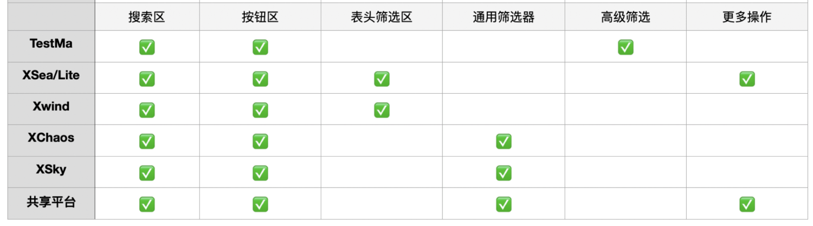

<h4 style="color: #fff; background-color: #88D498; padding: 4px 8px; border-radius: 4px;">最全通用</h4>
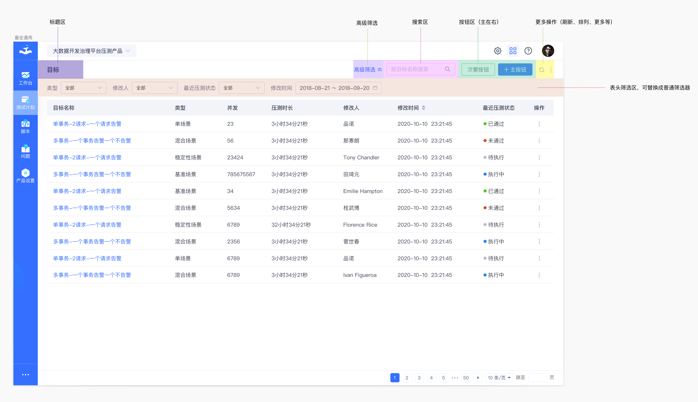
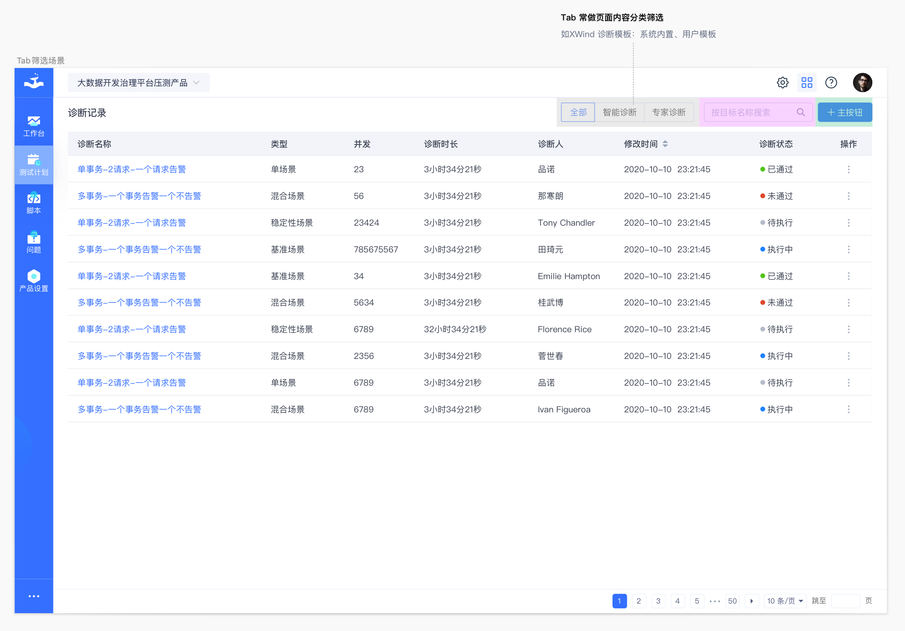
<h4 style="color: #fff; background-color: #88D498; padding: 4px 8px; border-radius: 4px;">表头筛选</h4>

> 涵盖 XSea 99%的场景、XChaos 20%场景

<strong>使用说明：</strong>多为表头的筛选字段直接带入，方便用户快速筛选。常用于列表页

建议列表可通过表头点击，使用户更快捷做筛选条件排序。表单越左数据越重要，使用筛选频率最高

<strong>特点：</strong>

较为轻量的实时筛选，无确定搜索按钮。

用户多数场景为单一筛选

<strong>产品案例：</strong>XSea   99%以上的场景、XChaos 20%场景

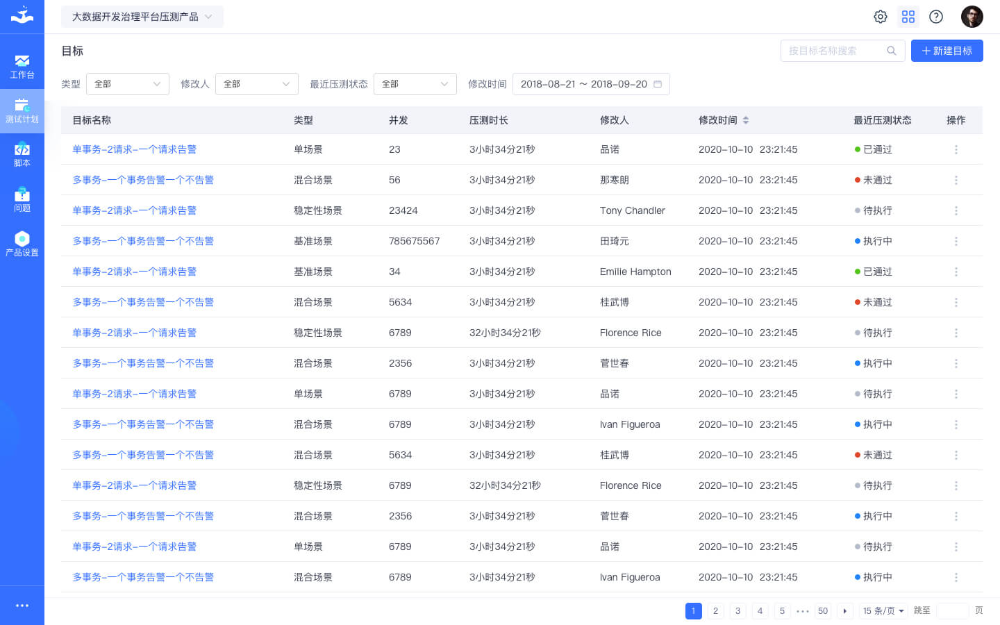
<h4 style="color: #fff; background-color: #88D498; padding: 4px 8px; border-radius: 4px;">普通筛选</h4>

> 涵盖 XSky99%、XChaos 99%、共享平台 99%场景

<strong>使用说明：</strong>独立筛选区，不仅限于列表页，也可用于概览、可视化等页面。

<strong>特点：</strong>

非实时筛选，有确定搜索按钮。

重筛选器，条件多，用户可以选择查看符合一类或多类条件下的内容。

<strong>产品案例：</strong>XSky  100%的场景

<strong>白底主场景：适用于更多的列表场景</strong>
 

<strong>灰底主场景：概览、视觉可视化等需要明显模块化的</strong>

↓白底的↓

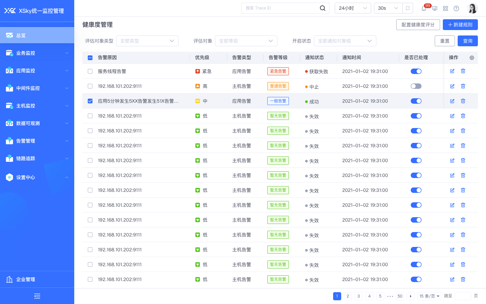

↓灰底的↓

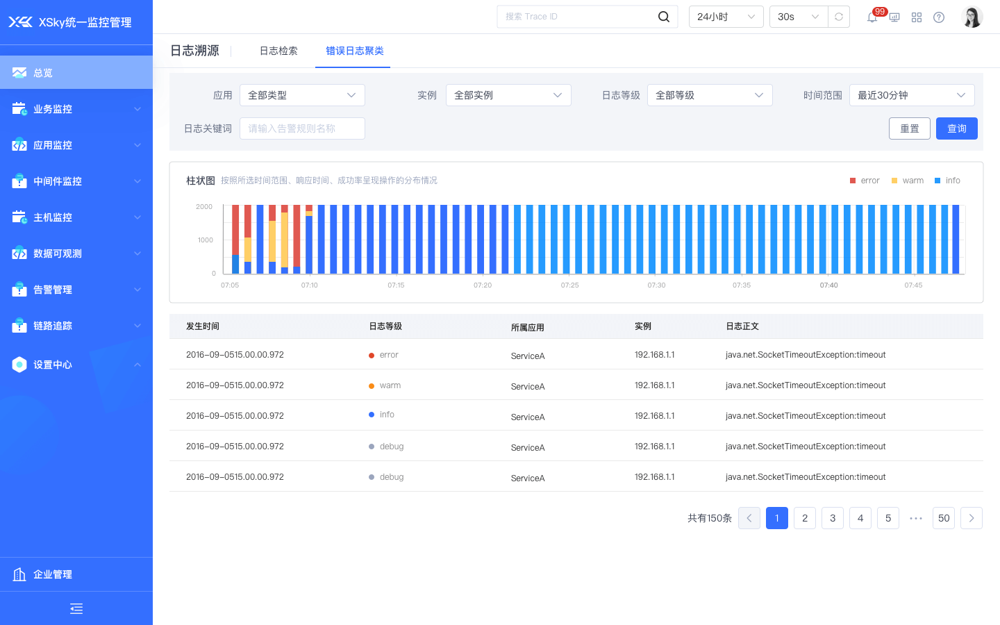
<h4 style="color: #fff; background-color: #88D498; padding: 4px 8px; border-radius: 4px;">普通筛选折叠</h4>

<strong>使用说明：</strong>同上，区别在于默认显示使用频率较多的筛选条件，频率较少的使用“展开”、“收起”这种方式。视业务当前页面场景决定。

<strong>特点：</strong>

更多常用筛选且让筛选器更为简洁，并可保留更多选项

<strong>产品案例：</strong>XChaos 80%场景

↓默认状态↓

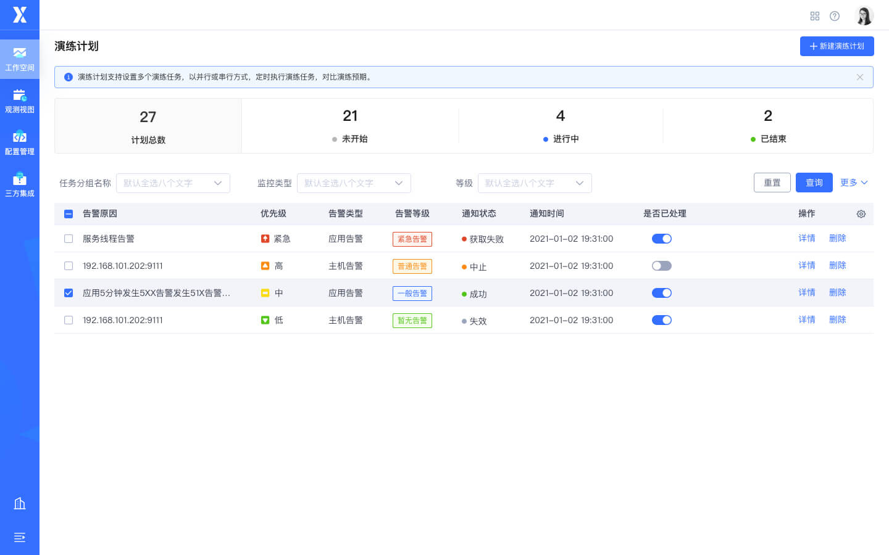

↓展开后↓

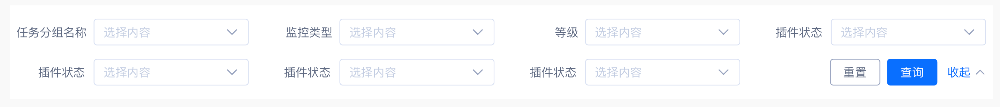
<h4 style="color: #fff; background-color: #88D498; padding: 4px 8px; border-radius: 4px;">高级筛选</h4>

> 保留高频的筛选条件，将复杂的筛选项隐藏在「高级筛选」中

<strong>特点：</strong>筛选为辅助功能收起，在当前场景下，空间利用率更高

<strong>产品案例：</strong>TestMa  100%的场景

↓默认状态↓

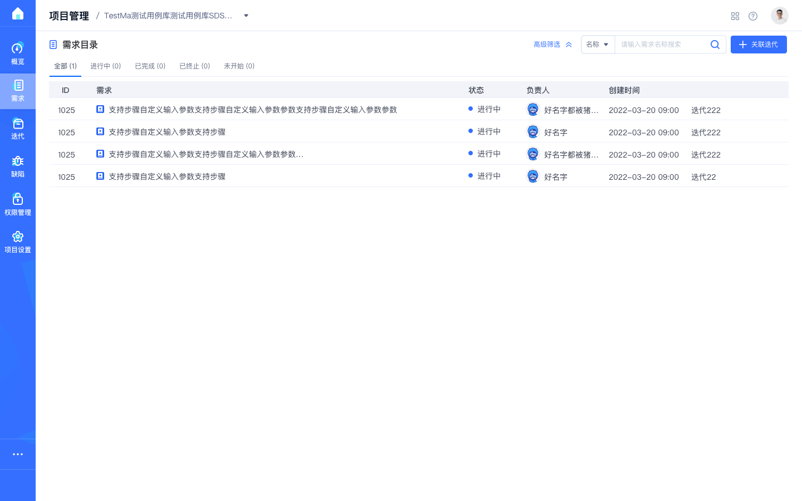

↓展开后↓

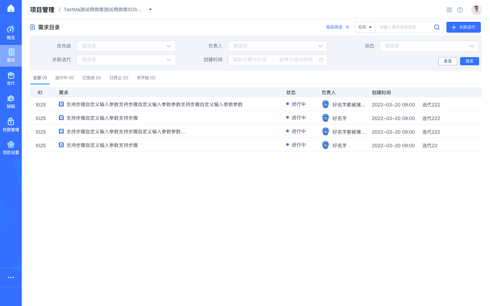

<strong>规则说明</strong>

筛选项  收起用24栅格

<strong>布局：</strong>筛选项收起的情况下只能放一行，4列栅格，选项间距统一16px。筛选区占3列栅格，靠左

<strong>按钮：</strong>按钮区占1列栅格，靠右。     按钮是否需要看业务场景（可以不放置）

<strong>适配：</strong>4列栅格适配，按钮右侧排放; lable字段，8个字或6个字，8个字无法满足的情况换行处理

<strong>高级筛选</strong>

展开的情况使用24栅格，推荐4列栅格展示，按钮区占一个栅格区域，右下角排列

可以根据页面实际显示宽度，显示3列，甚至2列

<strong>lable字段极限状态</strong>

字符限制样式，限制16个字符，超出打点，hover显示

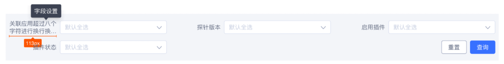
